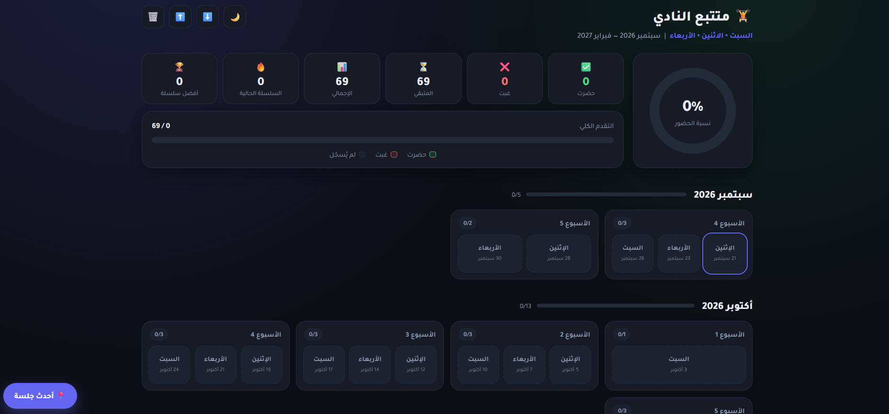

<div align="center">

# 🏋️ متابع النادي

### تطبيق ويب لمتابعة حضور النادي والالتزام بالتمارين

</div>

---

## 📌 عن المشروع

متابع النادي هو تطبيق ويب بسيط يساعد على تسجيل حضور النادي
ومتابعة الالتزام بالتمارين خلال فترة زمنية محددة.

تم تصميم التطبيق ليكون سهل الاستخدام، بحيث يمكن تسجيل حالة كل
تمرين بسرعة ومتابعة الإحصائيات والتقدم بشكل واضح.

## ✨ المميزات

- 📊 لوحة تحكم لعرض إحصائيات الحضور والتقدم
- 📅 جدول تدريبي لمدة ستة أشهر
- ✅ تسجيل الحضور
- ❌ تسجيل عدم الحضور
- 📈 حساب نسبة الالتزام تلقائيًا
- 📋 إحصائيات شهرية
- 💾 حفظ البيانات تلقائيًا داخل المتصفح
- 🌙 الوضع الليلي والنهاري
- 📱 تصميم متجاوب مع الجوال والكمبيوتر
- 📤 إمكانية تصدير واستيراد نسخة احتياطية من البيانات

## 🗓️ جدول التمارين

الجدول الأساسي للتطبيق:

- السبت
- الاثنين
- الأربعاء

وتغطي المتابعة الفترة من:

**سبتمبر 2026 إلى فبراير 2027**

## 🛠️ التقنيات المستخدمة

- HTML
- CSS
- JavaScript
- LocalStorage

## 🚀 تشغيل المشروع

لا يحتاج المشروع إلى تثبيت برامج أو مكتبات خارجية.

يمكن تشغيله مباشرة من خلال فتح:

`index.html`

أو استخدام الموقع المنشور عبر GitHub Pages.

## 💾 حفظ البيانات

يتم حفظ بيانات الحضور محليًا داخل المتصفح باستخدام
`LocalStorage`.

لا يحتاج التطبيق إلى حساب أو قاعدة بيانات خارجية.

## 📸 معاينة المشروع




## 📁 هيكل المشروع

```text
متابع-النادي/
│
├── index.html
├── assets/
│   └── preview.png
└── README.md
